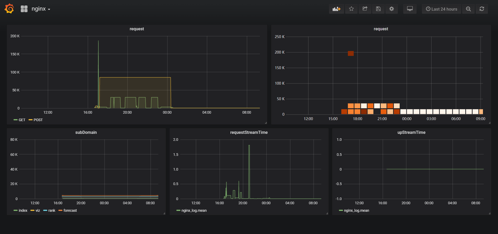

# Nginx-Log-Monitor
[](https://opensource.org/licenses/mit-license.php)



A simple monitor to load nginx logs and save to InfluxDB.

This Project implemented as two separate parts:
1. Read, clean, process and append the each log to the databse from nginx log file "access.log". This part is implemented in Go.
2. Fetch the relevant information from the databse and visualize the data element by using Grafana.

## Usage
- Get influxDB in Go
```
$ go get github.com/influxdata/influxdb
```
- Install and run InfluxDB
```
$ docker pull influxdb
$ docker run influxdb
```
- Install and run Grafana
```
$ wget https://s3-us-west-2.amazonaws.com/grafana-releases/release/grafana_5.3.2_amd64.deb 
$ sudo dpkg -i grafana_5.3.2_amd64.deb
$ sudo service grafana-server start
```
- Run `procrss.go` and open the follwing url , then you will see the visualization
```
https://localhost:3000
```
- Open `https://localhost:9999/monitor` will return monitor's general info with json
```
{
	"handleLine": 999,
	"tps": 123,
	"readChanLen": 456,
	"writeChanLen": 456,
	"runTime": "8h47m51.6090878s",
	"errNum": 123
}
```


